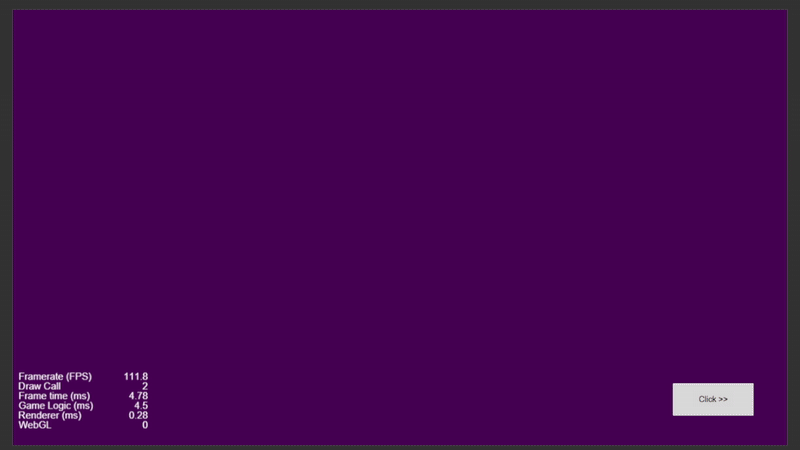

# Cocos Creator 2D Learning Projects

This repository contains beginner-friendly projects designed to help you get started with Cocos Creator 2D. Each project focuses on fundamental concepts in Cocos Creator.

---

## Table of Contents

* [Spawning Prefabs in a Grid and Setting Label using Counter](#spawning-prefabs-in-a-grid-and-setting-label-using-counter)
* [Spawn Prefabs Randomly within an Area and Remove All Prefabs](#spawn-prefabs-randomly-within-an-area-and-remove-all-prefabs)
* [Rotating Object around a Central Node and Button to Increase/Decrease Speed](#rotating-object-around-a-central-node-and-button-to-increase-decrease-speed)
* [Drag-and-Drop with Reset Feature](#drag-and-drop-with-reset-feature)
* [Toggle Between Two Images on Click using Sprite Frame](#toggle-between-two-images-on-click-using-sprite-frame)
* [Toggle Between Two Colored Backgrounds on Click](#toggle-between-two-colored-backgrounds-on-click)
* [Instantiate Prefab with Random Color and Incrementing Label](#instantiate-prefab-with-random-color-and-incrementing-label)

---

## Spawning Prefabs in a Grid and Setting Label using Counter

**Overview:**
This project demonstrates how to spawn a prefab dynamically and update its label using a counter. Every time a button is clicked, a new box is created and added to a UI panel with a unique number.

**What This Project Does:**

* Spawns a prefab each time the button is clicked.
* Adds the prefab to a UI panel.
* Displays a unique number on each prefab via Label.

**What We Learned:**

* How to use the `@property` decorator to expose script variables in the Cocos Editor.
* How to instantiate prefabs dynamically using `cc.instantiate`.
* How to parent objects using `.parent =`.
* How to find child nodes using `.children[0]`.
* How to update label text using `.getComponent(cc.Label).string`.
* How to auto-increment numbers using `counter++`.

---

## Spawn Prefabs Randomly within an Area and Remove All Prefabs

**Overview:**
Learn how to spawn prefabs randomly within a defined area and remove them when needed.

**What This Project Does:**

* Spawns prefabs at random positions in a defined area.
* Removes all spawned prefabs when the "Remove All" button is clicked.

**What We Learned:**

* How to expose variables to the Cocos Creator editor using `@property`.
* How to spawn prefabs dynamically using `cc.instantiate`.
* How to manage a spawn area by calculating its size and using random positions.
* How to remove all children from a node with `removeAllChildren()`.
* How to link UI buttons to functions for interactive gameplay.

---

## Rotating Object around a Central Node and Button to Increase/Decrease Speed

**Overview:**
A rotating object follows a circular path around a central node with adjustable speed.

**What This Project Does:**

* Circular rotation using trigonometric functions.
* Buttons to increase/decrease rotation speed.
* Toggle rotation on/off.

**What We Learned:**

* How to rotate a node around another node using trigonometric functions and a radius.
* How to expose variables to the editor using `@property`.
* How to use the `update()` method for continuous changes every frame.
* How to adjust rotation speed with buttons.
* How to toggle actions (like rotation) using boolean flags.

---

## Drag-and-Drop with Reset Feature

**Overview:**
Implements drag-and-drop mechanics with a reset if the cursor leaves the canvas.

**What This Project Does:**

* Draggable sprite.
* Auto-aligns to drop zone center if dropped inside.
* Resets position if cursor leaves canvas.

**What We Learned:**

* How to implement drag-and-drop functionality in Cocos Creator.
* How to use touch event listeners to track user input.
* How to detect if a sprite is inside a target zone and align it accordingly.
* How to reset a sprite’s position when the mouse leaves the canvas.

---

## Toggle Between Two Images on Click using Sprite Frame

**Overview:**
Toggles between two images on a node when the user clicks.

**What This Project Does:**

* Switches between two sprite frames on click.
* Uses `@property` to expose image assets and node in the editor.
* Maintains a state flag to determine the current image.

**What We Learned:**

* How to switch between two images dynamically using sprite frames.
* How to expose assets and nodes to the editor using `@property`.
* How to get a component from a node using `getComponent()`.
* How to handle a click event to trigger interactivity.
* How to manage a toggle state using a boolean variable.

---

## Toggle Between Two Colored Backgrounds on Click

**Overview:**
Switches between red and green backgrounds each time the user clicks.

**What This Project Does:**

* Alternates active state of two background nodes.
* Uses a boolean flag for state tracking.
* Demonstrates conditional rendering logic.

**What We Learned:**

* How to show and hide nodes using `.active`.
* How to toggle between states using a boolean flag.
* How to expose nodes to the editor using `@property`.
* How to use `onClick()` for user interaction.
* How to manage component lifecycle with `onLoad()`.

---

## Instantiate Prefab with Random Color and Incrementing Label

**Overview:**
Creates multiple prefab instances with unique colors and labels.

**What This Project Does:**

* Instantiates a prefab on button click.
* Assigns a random background color.
* Labels each prefab with a unique number using a counter.
* Adjusts visibility using opacity.

**What We Learned:**

* How to instantiate prefabs at runtime.
* How to parent objects to a specific node (e.g., a UI panel).
* How to update label text dynamically using a counter.
* How to create random colors with JavaScript and apply them.
* How to set node visibility using the `opacity` property.

---

## Conclusion

Explore each project to build your Cocos Creator 2D skills. Clone, experiment, and create your own projects with the knowledge gained here.

---

---
