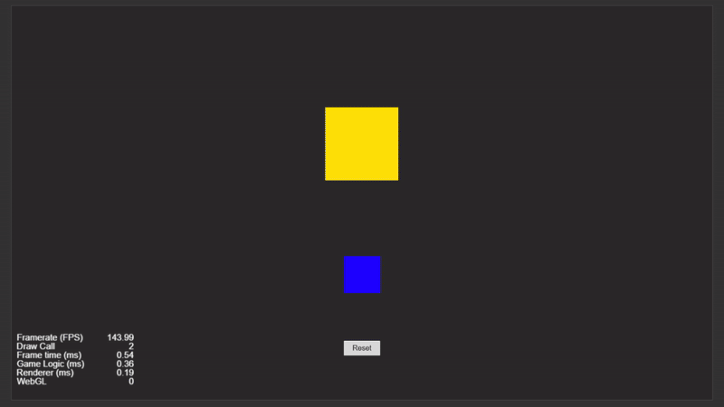

# Cocos Creator 2D Learning Projects

This repository contains beginner-friendly projects designed to help you get started with Cocos Creator 2D. Each project focuses on fundamental concepts in Cocos Creator.

---

## Table of Contents

---

- [Spawning Prefabs in a Grid and Setting Label using Counter](#spawning-prefabs-in-a-grid-and-setting-label-using-counter)

---

- [Spawn Prefabs Randomly within an Area and Remove All Prefabs](#spawn-prefabs-randomly-within-an-area-and-remove-all-prefabs)

---

- [Rotating Object around a Central Node and Button to Increase/Decrease Speed](#rotating-object-around-a-central-node-and-button-to-increase-decrease-speed)

---

- [Drag-and-Drop with Reset Feature](#drag-and-drop-with-reset-feature)

---

## Spawning Prefabs in a Grid and Setting Label using Counter

**Overview:**
This project demonstrates how to spawn a prefab dynamically and update its label using a counter. Every time a button is clicked, a new box is created and added to a UI panel with a unique number based on the counter.

**What This Project Does:**
- Spawns a prefab (e.g., a box) each time the button is clicked.
- The box is added to a UI panel.
- Each box has a Label component that displays a number that is updated with an internal counter.

This is useful for creating dynamic UI lists, item generators, or other runtime-generated content.

**Link to Project:**
[Spawning Prefabs in a Grid and Setting Label using Counter](#)

---

## Spawn Prefabs Randomly within an Area and Remove All Prefabs

**Overview:**
In this project, you'll learn how to spawn prefabs randomly within a defined area and remove them when needed. It includes two buttons: one to spawn the prefabs and another to remove all of them from the scene.

**What This Project Does:**
- The "Spawn" button creates prefabs at random positions inside a specified spawn area.
- The "Remove All" button removes all the spawned prefabs from the scene.

This technique is ideal for spawning game objects like enemies, items, or obstacles at runtime, with the ability to clear them as needed.

**Link to Project:**
[Spawn Prefabs Randomly within an Area and Remove All Prefabs](#)

---

## Rotating Object around a Central Node and Button to Increase/Decrease Speed

**Overview:**
This project involves rotating an object around a central point using trigonometric functions. The rotation can be toggled on or off, and the speed of the rotation can be adjusted with two buttons: one to increase and one to decrease the speed.

**What This Project Does:**
- A node (sprite or object) rotates around a central point (another node) following a circular path.
- The user can control the rotation speed with buttons that either increase or decrease the speed of the rotation.
- Trigonometry is used to calculate the position of the rotating object along the circular path.

This is useful for learning rotation mechanics and how to control the speed of dynamic movement in your game.

**Link to Project:**
[Rotating Object around a Central Node and Button to Increase/Decrease Speed](#)

---

## Drag-and-Drop with Reset Feature

**Overview:**
This script enables users to drag a sprite within the scene and drop it into a designated target area. If the sprite is dropped inside the target zone, it aligns to the center. Additionally, if the mouse pointer leaves the canvas, the sprite is reset to its default position.

**What This Project Does:**
- Users can drag a sprite around the screen.
- If the sprite is dropped inside a predefined drop zone, it will align to the center of that zone.
- If the mouse leaves the canvas, the sprite will reset to its original position.

This project is a great way to implement drag-and-drop mechanics with additional functionality such as resetting objects.

**Link to Project:**
[Drag-and-Drop with Reset Feature](#)

---

## Conclusion

Explore each project to build your Cocos Creator 2D skills. Clone, experiment, and create your own projects with the knowledge gained here.

---

