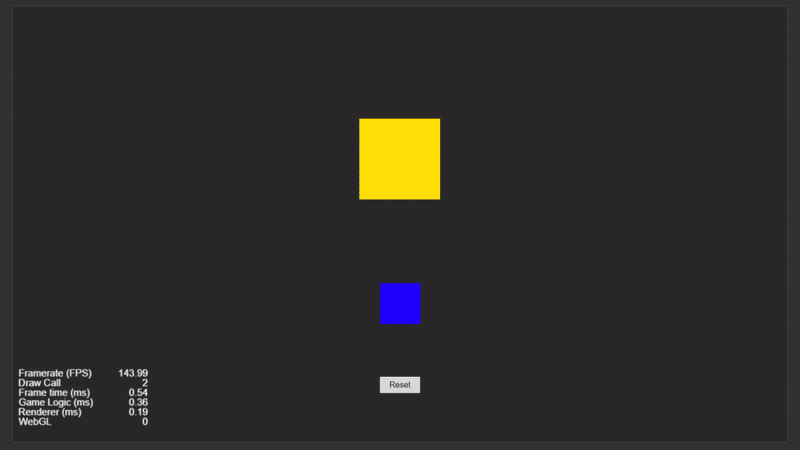

# Drag-and-Drop with Reset Feature


This script allows users to drag a sprite within a scene, and once released, it checks if the sprite is inside a designated drop zone. If the sprite is inside the drop zone, it aligns the sprite to the center of the drop zone. Additionally, if the mouse pointer leaves the canvas, the sprite is reset to its default position.

---



---

## What This Project Does

* **Draggable Sprite:** The user can drag a sprite around the screen.
* **Target Area:** There is a drop zone, and if the sprite is dropped inside, it aligns to the center of the zone.
* **Reset Mechanism:** If the mouse leaves the canvas, the sprite resets back to its initial position.

---

## Code Explanation

```ts
const { ccclass, property } = cc._decorator;
```

* `ccclass`: Decorator used to define this class as a component that can be attached to a Cocos Creator node.
* `property`: Decorator used to expose class variables to the Cocos Creator editor so they can be assigned easily in the Inspector panel.

---

```ts
@ccclass
export default class dragNResetLogic extends cc.Component {
```

* `@ccclass`: Marks the class as a component in Cocos Creator.
* `dragNResetLogic`: The name of the class that handles the drag-and-drop logic.
* `extends cc.Component`: The class extends `cc.Component`, making it a Cocos Creator component.

---

### Defining Properties

```ts
@property(cc.Node)
draggableSpriteSplash: cc.Node = null; // The sprite node that will be draggable
```

* `draggableSpriteSplash`: A property to reference the sprite that will be dragged.
* `cc.Node`: Indicates this variable will hold a node (e.g., a sprite or button).
* `= null`: Initializes the property as null until it's assigned in the editor.

```ts
@property(cc.Node)
boxSpriteSplash: cc.Node = null; // The target drop zone where the sprite can align to center
```

* `boxSpriteSplash`: A property to reference the drop zone where the sprite can be aligned when dropped.

```ts
private isDragging: boolean = false; // Flag to track whether the node is being dragged
private defaultPosition: cc.Vec3 = null; // Stores the original/default position of the draggable node
```

* `isDragging`: A boolean flag used to determine whether the sprite is being dragged.
* `defaultPosition`: Stores the initial position of the draggable sprite so it can be reset if necessary.

---

### Lifecycle Method

```ts
onLoad() {
    this.defaultPosition = this.draggableSpriteSplash.position;
    this.draggableSpriteSplash.on(cc.Node.EventType.TOUCH_START, this.onTouchStart, this);
    this.draggableSpriteSplash.on(cc.Node.EventType.TOUCH_MOVE, this.onTouchMove, this);
    this.draggableSpriteSplash.on(cc.Node.EventType.TOUCH_END, this.onTouchEnd, this);
    this.draggableSpriteSplash.on(cc.Node.EventType.TOUCH_CANCEL, this.onTouchEnd, this);
    cc.game.canvas.addEventListener("mouseleave", this.onMouseLeave.bind(this));
}
```

* `onLoad()`: This method is called when the component is loaded.
* `this.draggableSpriteSplash.position`: Stores the initial position of the sprite.
* `.on(cc.Node.EventType.TOUCH_START, ...)`: Registers a listener for when a touch starts, enabling the drag.
* `.on(cc.Node.EventType.TOUCH_MOVE, ...)`: Registers a listener for continuous touch movement, updating the sprite’s position.
* `.on(cc.Node.EventType.TOUCH_END, ...)`: Registers a listener for when the touch ends, deciding whether to align the sprite to the drop zone.
* `cc.game.canvas.addEventListener("mouseleave", ...)`: Registers a listener for when the mouse leaves the canvas, triggering the reset.

---

### Dragging Functions

```ts
onTouchStart(event: cc.Event.EventTouch) {
    this.isDragging = true;
}
```

* `onTouchStart()`: Activates the dragging mode when the touch begins (e.g., finger or mouse click).

```ts
onTouchMove(event: cc.Event.EventTouch) {
    if (this.isDragging) {
        let delta = event.getDelta();
        let deltaVec3 = new cc.Vec3(delta.x, delta.y, 0);
        let newPos = this.draggableSpriteSplash.position.add(deltaVec3);
        this.draggableSpriteSplash.setPosition(newPos);
    }
}
```

* `onTouchMove()`: Updates the sprite’s position based on the touch movement.
* `event.getDelta()`: Retrieves the change in touch position.
* `this.draggableSpriteSplash.setPosition(newPos)`: Sets the new position of the sprite.

```ts
onTouchEnd(event: cc.Event.EventTouch) {
    this.isDragging = false;
    if (this.isInsideDropZone()) {
        this.alignToCenter();
    }
}
```

* `onTouchEnd()`: Deactivates dragging when the touch ends.
* `this.isInsideDropZone()`: Checks if the sprite is within the drop zone.
* `this.alignToCenter()`: Aligns the sprite to the center of the drop zone if it’s inside.

---

### Helper Functions

```ts
alignToCenter() {
    let boxCenter = this.boxSpriteSplash.position;
    this.draggableSpriteSplash.setPosition(boxCenter);
}
```

* `alignToCenter()`: Moves the draggable sprite to the center of the drop zone.

```ts
isInsideDropZone(): boolean {
    let draggablePos = this.draggableSpriteSplash.getBoundingBoxToWorld();
    let dropZonePos = this.boxSpriteSplash.getBoundingBoxToWorld();
    return dropZonePos.intersects(draggablePos);
}
```

* `isInsideDropZone()`: Checks if the draggable sprite’s bounding box intersects with the drop zone’s bounding box. Returns `true` if they overlap.

```ts
resetPosition() {
    this.draggableSpriteSplash.setPosition(this.defaultPosition);
}
```

* `resetPosition()`: Resets the draggable sprite to its initial position.

```ts
onMouseLeave() {
    this.resetPosition();
}
```

* `onMouseLeave()`: If the mouse leaves the canvas, the sprite is reset to its default position.

---

## Key Features

1. **Drag and Drop**: Enables dragging and dropping of the sprite to a specific target zone.
2. **Reset Mechanism**: Resets the position of the sprite if the mouse leaves the game area.
3. **Target Zone Detection**: Ensures the sprite only aligns to the drop zone when within its boundaries.

---

## What We Learned

1. **How to implement drag-and-drop functionality in Cocos Creator.**
2. **How to use touch event listeners to track user input.**
3. **How to detect if a sprite is inside a target zone and align it accordingly.**
4. **How to reset a sprite’s position when the mouse leaves the canvas.**

---

## Glossary of Key Terms

| Term / Symbol             | Meaning                                                             |
| ------------------------- | ------------------------------------------------------------------- |
| `cc.Node`                 | A general-purpose container for game objects in Cocos Creator       |
| `@property`               | A decorator to expose a property to the Cocos Creator Editor        |
| `Vec3`                    | A 3D vector class used to represent positions or directions         |
| `getDelta()`              | Returns the change in position between two frames for the touch     |
| `getBoundingBoxToWorld()` | Retrieves the bounding box of a node in the world coordinate system |
| `intersects()`            | Checks if two bounding boxes overlap                                |
| `onTouchStart`            | Called when the touch begins                                        |
| `onTouchMove`             | Called continuously as the user drags the sprite                    |
| `onTouchEnd`              | Called when the touch ends, checking if the sprite should align     |

---

## Summary

This script allows a sprite to be dragged and dropped in Cocos Creator, with a reset feature if the mouse leaves the canvas. It checks whether the sprite is inside a target drop zone and aligns it to the center if so.

---

