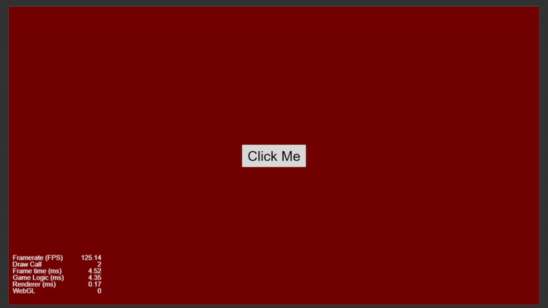

# Toggle Between Two Colored Backgrounds on Click


---



## Overview

This project creates a toggle system that switches between two background colors—**red** and **green**—each time the user clicks. It utilizes Cocos Creator’s node activation system (`node.active`) and a boolean flag to manage which background is visible. This is useful for learning how to control visibility and manage simple UI logic with TypeScript.

---

## What This Project Does

* **Toggles between two background nodes**: Activates one and deactivates the other.
* **Boolean flag control**: Uses a flag to remember which background is active.
* **Editor-exposed nodes**: Uses `@property` to allow background nodes to be assigned in the editor.
* **Simple UI logic**: A great intro to conditional rendering and interaction handling.

---

## Code Explanation (Explain Each Word in Depth and Easy Way)

```ts
const { ccclass, property } = cc._decorator;
```

* `const`: Declares a constant (unchangeable) reference.
* `{ ccclass, property }`: Pulls in decorators used to mark up classes and properties in Cocos.

  * `ccclass`: Registers the class as a component.
  * `property`: Makes a class member editable in the Cocos Editor.

---

```ts
@ccclass
export default class NewClass extends cc.Component {
```

* `@ccclass`: Marks the class so it appears as a component in the editor.
* `export default class NewClass`: Defines and exports the component class named `NewClass`.
* `extends cc.Component`: Inherits base features of a Cocos Creator component.

---

```ts
@property(cc.Node) bgRed: cc.Node = null;
```

* `@property(cc.Node)`: Makes `bgRed` visible in the editor and of type `cc.Node`.
* `bgRed`: This node represents the red background.
* `= null`: Starts as `null` until you assign it in the editor.

---

```ts
@property(cc.Node) bgGreen: cc.Node = null;
```

* `bgGreen`: This node represents the green background, also exposed to the editor.

---

```ts
private isRedActive: boolean = true;
```

* `private`: Limits access to within the class.
* `isRedActive`: Tracks which background is currently shown.
* `boolean = true`: Starts with the red background visible.

---

```ts
onLoad() {
    this.bgRed.active = true;
    this.bgGreen.active = false;
}
```

* `onLoad()`: A lifecycle method that runs before `start()`.
* `.active`: Controls node visibility—`true` shows it, `false` hides it.
* This sets up the initial state with red shown and green hidden.

---

```ts
onClick() {
    this.isRedActive = !this.isRedActive;
    this.bgRed.active = this.isRedActive;
    this.bgGreen.active = !this.isRedActive;
}
```

* `onClick()`: Method linked to a click event (like a button press).
* `this.isRedActive = !this.isRedActive`: Flips the current state (true becomes false and vice versa).
* `this.bgRed.active = this.isRedActive`: Shows/hides the red background based on the flag.
* `this.bgGreen.active = !this.isRedActive`: The opposite logic for green.

---

## What We Learned

1. **How to show and hide nodes** using `.active`.
2. **How to toggle between states** using a boolean flag.
3. **How to expose nodes to the editor** using `@property`.
4. **How to use `onClick()`** for user interaction.
5. **How to manage component lifecycle** with `onLoad()`.

---

## Glossary of Key Terms

| Term / Symbol | Meaning                                                     |
| ------------- | ----------------------------------------------------------- |
| `@property`   | Makes a class property editable in the editor               |
| `cc.Node`     | A general game object in Cocos Creator                      |
| `.active`     | Boolean that controls if the node is visible/active         |
| `onLoad()`    | Called before the `start()` method when the component loads |
| `onClick()`   | Custom method triggered by a click event                    |
| `!`           | Logical NOT operator — flips a boolean value                |

---


